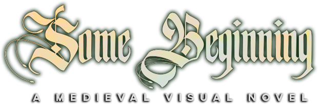

<!-- https://github.com/othneildrew/Best-README-Template -->

 
  

    
  

 

# Some Beginning

<!-- BADGES
[![Contributors][contributors-shield]][contributors-url]
[![Stargazers][stars-shield]][stars-url]
[![MIT License][license-shield]][license-url]
-->

Some Beginning is a medieval-themed visual novel game with an enticing story and charming characters!
  

<!-- BUILT WITH -->
### Built With

[![Renpy][Renpy]][Renpy-url]
  

<!-- LICENSE -->
### License

Distributed under the MIT License. Please see the [license file](https://github.com/Freezanator/SomeBeginning/blob/main/LICENSE.txt) for more information.

<!-- MARKDOWN LINKS & IMAGES -->
<!-- https://www.markdownguide.org/basic-syntax/#reference-style-links -->
[contributors-shield]: https://img.shields.io/github/contributors/github_username/repo_name.svg?style=for-the-badge
[contributors-url]: https://github.com/Freezanator/SomeBeginning/graphs/contributors
[stars-shield]: https://img.shields.io/github/stars/github_username/repo_name.svg?style=for-the-badge
[stars-url]: https://github.com/Freezanator/SomeBeginning/stargazers
[license-shield]: https://img.shields.io/github/license/github_username/repo_name.svg?style=for-the-badge
[license-url]: https://github.com/Freezanator/SomeBeginning/blob/main/LICENSE.txt
[Renpy]: https://img.shields.io/badge/Ren'py-FF7F7F?style=for-the-badge&logo=renpy&logoColor=white
[Renpy-url]: https://www.renpy.org/
